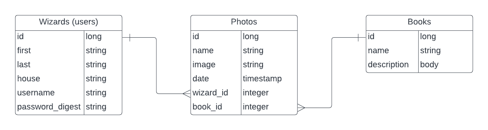
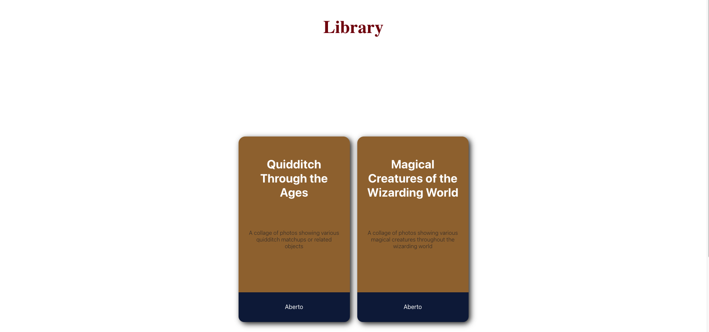
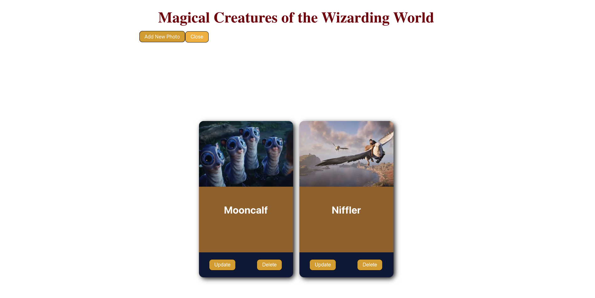

# Wizard Photo Library Application

This is a full-stack application that allows a user to login or sign up for access. Once logged in, the user is able to see the library of books available or select from the navigation to create a new book. If the user chooses to open a book, they will be shown a list of photo cards associated with that book. The user can select to update the image, delete the photo card or add a new image to the book. From the navigation menu, the user can login out and be returned to the login page. 

## Technology

-Built with React.js, Ruby on Rails, CSS, Active Record, SQLite

## Installation
### Steps
1. Fork and clone this repo to your local device. Open the folder in two seperate terminals to run the front and backend. In both terminal ensure you are in the wizard_book_collage folder then in one terminal run bundle install. Once that is completed, in the same terminal run rails s. This will begin running the backend.
2. In your 2nd terminal inside of wizard_book_collage, run: npm install --prefix client. This will install the necessary node files to run the frontend. Once that is complete, run: npm start --prefix client. This will launch the frontend or client facing application on the browser. 

## ERD

## Screenshots
### Login

### Navigation

### Library

### Book

